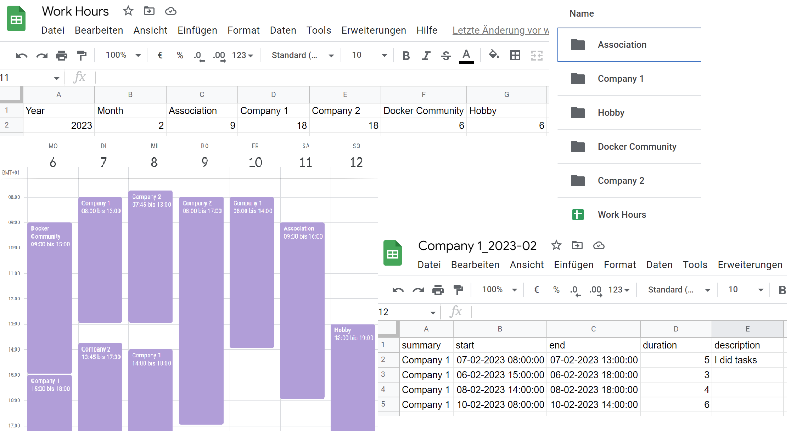
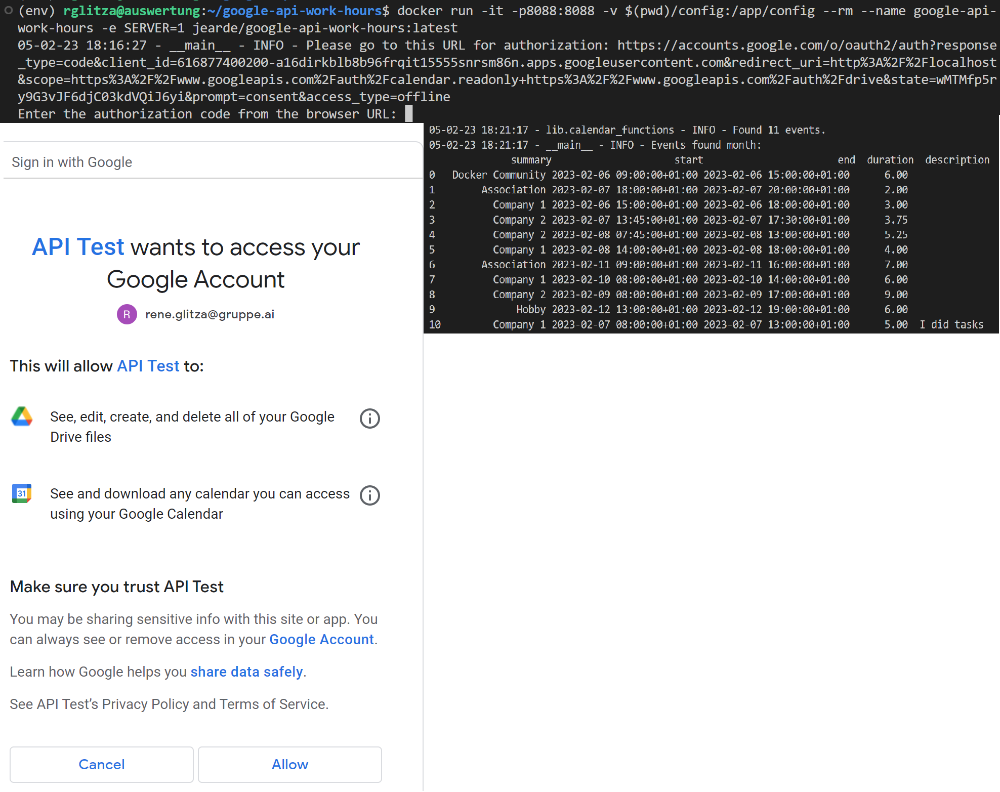

# Google API Work Hours Export
A Python Programm using the Google Workspace API for exporting work hours from calendar to a Google Sheet.

A Docker image is provided for easy deployment and executing the synchrinization every 12h.



## Getting Started
1. [Prepare your Google Workspace for the script](#google-workspace)
    1. Create a Google Drive folder for the statistics
    2. Create a Google Sheet in the folder
    3. Create a Google Calendar for the work hours
2. [Enable the Google Workspace API](#google-workspace-api)
    1. Create a OAuth 2.0 Client ID
    2. Add the Google Workspace API scopes
3. [Run the script](#run-with-docker)
    1. Build the image
    2. Run the container a first time interactive
    3. [Create the Authentification Token](#create-authentification-token)
    4. Stop the container
4. Run the script again to export the work hours to the Google Sheet.

## Google Workspace Preparation
### Google Workspace
1. Create a Google Drive folder for the statistics
    1. Add the ID of the folder to the `work_hours.json` file under folder_id
2. Create a Google Sheet in the folder
    1. Name the first sheet "Sheet1"
    2. (Optional) Add the needed columns in the first sheet: `"Month", <Company_1>, <Company_1>, ..., <Company_n>`
    3. Add the ID of the sheet to the `work_hours.json` file under sheet_id
3. Create a Google Calendar for the work hours
    1. Add the ID of the calendar to the `work_hours.json` file under calendar_id
    2. Add events for the time worked to the calendar with the following format: `<Company>`. Example: `Company A`

### Google Workspace API
1. Create a Google Cloud project
    1. Go to the [Google Cloud Console](https://console.cloud.google.com/)
    2. Create a new project
2. Enable the Google Workspace API
    1. Go to the [Google Cloud Console](https://console.cloud.google.com/apis/dashboard)
    2. Enable the APIs: Drive, Sheers, Calendar, People
3. Create a OAuth 2.0 Client ID
    1. Go to the [Google Cloud Console](https://console.cloud.google.com/apis/credentials)
    2. Go to the Credentials tab
    3. Create a new OAuth 2.0 Client ID
    4. Download the JSON file and save it as `credentials.json` in the config folder
4. Add the Google Workspace API scopes
    1. Go to the [Google Cloud Console](https://console.cloud.google.com/apis/credentials)

<!-- ### Google Workspace API Service Account (not working)
-> https://support.google.com/a/answer/7378726?hl=en
1. Create a Service Account
    1. Go to the [Google Cloud Console](https://console.cloud.google.com/iam-admin/serviceaccounts)
    2. Create a new Service Account
    3. Add domain-wide delegation to the Service Account
    4. TODO: Add roles to the Service Account
2. Create a Service Account Key
    1. Go to the [Google Cloud Console](https://console.cloud.google.com/iam-admin/serviceaccounts)
    2. Select the Service Account
    3. Go to the Keys tab
    4. Create a new Key
    5. Download the JSON file and save it as `service_account.json` in the config folder -->

## Run with Docker
1. Build the image
    1. `docker build -t jearde/google-api-work-hours:latest .`
2. Run the container
    1. `docker run -it -p8088:8088 -v $(pwd)/config:/app/config --rm --name google-api-work-hours -e SERVER=1 jearde/google-api-work-hours:latest`
    2. or `docker-compose up -d`
3. Stop the container
    1. `docker stop google-api-work-hours`
    2. or `docker-compose down`

## Run manually
You can run the script manually in native Python. This will 
### Install dependencies
```bash
python3.9 -m venv env
source env/bin/activate
pip install --upgrade pip
pip install -r requirements.txt
```
### Run
```bash
source env/bin/activate
python work_hours/main.py
```

## Create Authentification Token
### Native Python
Run the script in native Python to create the `token.json` file
1. Copy your `credentials.json` files to the `config` folder
2. `python work_hours/main.py` to create the `token.json` file
3. The native authentication should open a browser window and ask you to login to your Google account automatically
### Docker
Run the script in Docker interactive mode to create the `token.json` file
1. Copy your `credentials.json` files to the `config` folder
2. Build the image `docker build -t jearde/google-api-work-hours:latest .`
3. Run the image interactive `docker run -it -p8088:8088 -v $(pwd)/config:/app/config --rm --name google-api-work-hours jearde/google-api-work-hours:latest`
4. Open the URL in your browser
5. Copy the code from the browser URL between `&code=` and `&scope=` and paste it into the terminal and press enter
6. The `token.json` should now be created in the `config` folder and used in the next runs
7. You now don't need to run the authentication again until your token has expired



## Features
1. Gets all calendar entries from the calendar with specified ID
2. Saves the calendar entries in a Google Sheet with specified folder
3. Creates a new folder for each name found in the calendar entries (company names)
4. Creates a new sheet for each name found in the calendar entries (hours per month for each company)
5. Appends the hours per month to a specified main spreadsheet
6. Appends the hours by calendar week to a specified main spreadsheet


## Not (ye) inluded
- [ ] Using a Service Account
- [ ] Using a Service Account in Docker container
- [X] Description of events in lists
- [X] Weekly Work Hours
- [ ] Calendar end date can be in next week or month